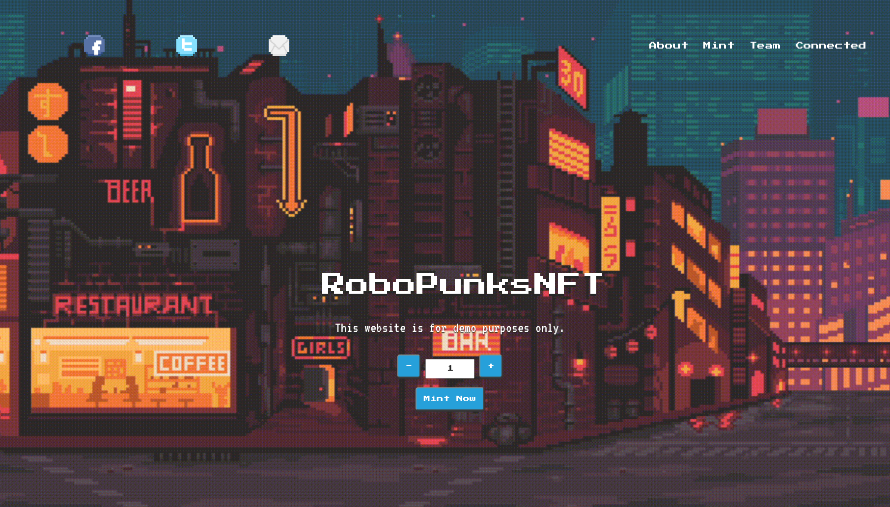

<!-- PROJECT LOGO -->

  <h3 align="center">RoboPunksNFT</h3>

<!-- ABOUT THE PROJECT -->
## About The Project
NFT full mint website, tested on sepolia network.

### 1. DashBoard

### Built With
* 
* 	

<!-- CONTRIBUTING -->
## Contributing

Contributions are what make the open source community such an amazing place to learn, inspire, and create. Any contributions you make are **greatly appreciated**.

If you have a suggestion that would make this better, please fork the repo and create a pull request. You can also simply open an issue with the tag "enhancement".
Don't forget to give the project a star! Thanks again!

1. Fork the Project
2. Create your Feature Branch (`git checkout -b feature/AmazingFeature`)
3. Commit your Changes (`git commit -m 'Add some AmazingFeature'`)
4. Push to the Branch (`git push origin feature/AmazingFeature`)
5. Open a Pull Request

<!-- CONTACT -->
## Contact

Stanley - [stanleytanyr@gmail.com](stanleytanyr@gmail.com)

Project Link: https://github.com/Mushimush/full-mint-website

